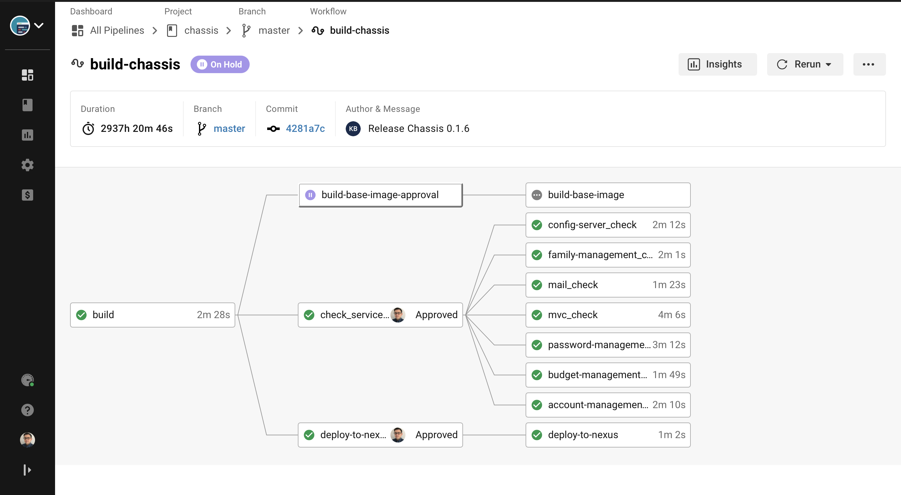
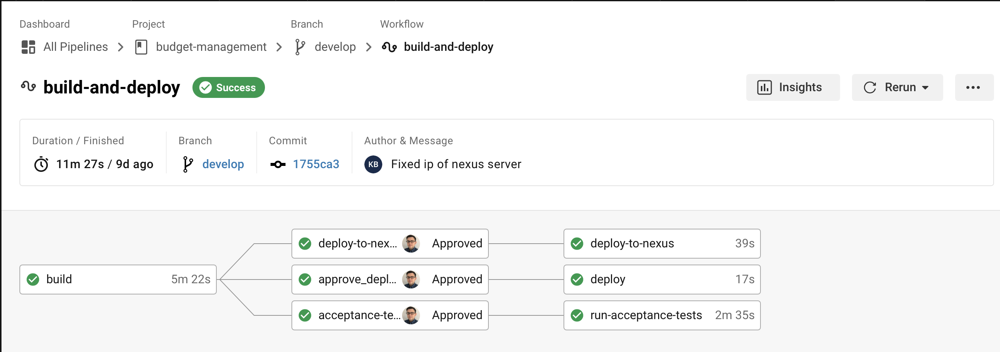
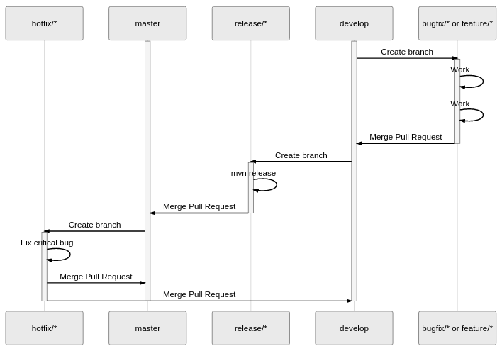

# Budget project overview  
Latest project version is hosted in bitbucket private repositories and I update from time to time repositories mentioned below. They are stripped off sensitive data and maintenance of so many repos for pet project as a single developer/qa/devops/whatever is time consuming task. Some things may not be up to date on github but I sync repos from time to time.   Project is hosted under https://konradboniecki.com.pl and is designed to work 24/7 but it's not expected to work all during development/refactorings. I'll be rich someday and have 2 environments :)

Budget consists of multiple springboot based microservices. All of them are build on top of my own chassis which holds common configuration for plugins, dependency management and defines common topics, for example logging. This way, its not visible (except configuration) that services are using config-client for fetching configuration

## Repositories
Below repositories don't not contain any sensitive data and chassis. Therefore they are not runnable.

Repository | link |
--- | --- |
Config repository | https://github.com/MilczekT1/config-git |
Account Management | https://github.com/MilczekT1/account-mgt-svc
Password Management | https://github.com/MilczekT1/password-mgt-svc
Mail | https://github.com/MilczekT1/mail-svc
Family Management | https://github.com/MilczekT1/family-mgt-svc
Budget Management | https://github.com/MilczekT1/budget-mgt-svc
MVC | https://github.com/MilczekT1/mvc-svc

Project contains also config server and gateway, but they are single class applications.

# Testing: 
Code coverage >= 80%  
Contract testing: In order to verify if communication between services is not broken at build time I use consumer driven contracts (Spring Cloud Contract). API producer has to pass generated tests for given contracts and once they are verified API client can mock response for that contract in integration tests.  All contracts are stored in contract-repository. Artifact is hosted in nexus. Api producer downloads contracts during build  in order to generate tests. Api Consumer download stubs during build in order to provide up to date mocks. This saved my "platform" several times from giving up:)

BDD: Acceptance tests which are executed against local environment (maven build) and production environment depending on given profile.

 Details | Tool |
--- | --- |
Tracking | Spring Cloud Sleuth + Zipkin (https://konradboniecki.com.pl/zipkin/)
Monitoring | Prometheus, Grafana
Databases | MongoDB && MySQL
CI/CD | CircleCi, Docker, Kubernetes, Nexus |

# Screenshot of chassis pipeline

# Example pipeline

# Release procedure

